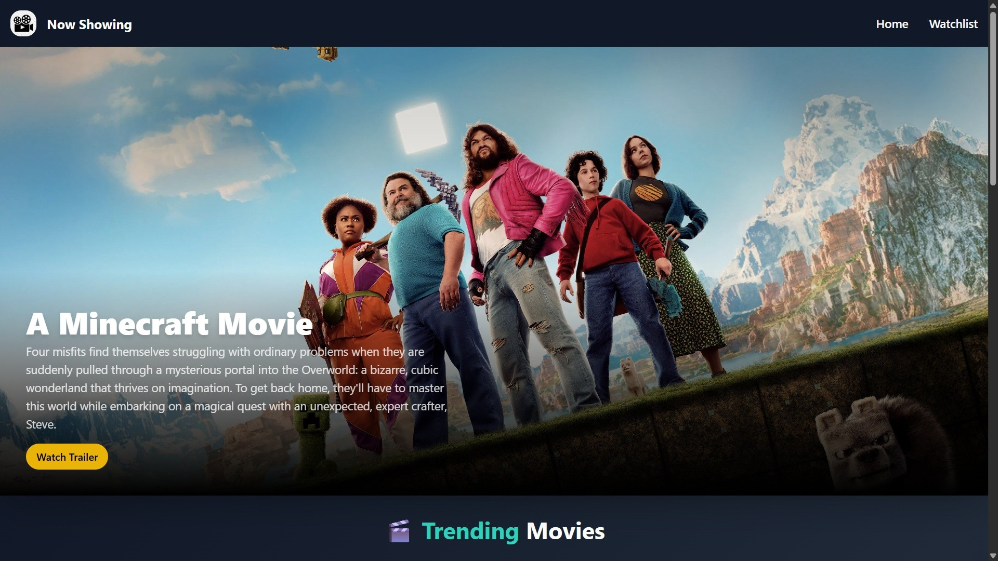
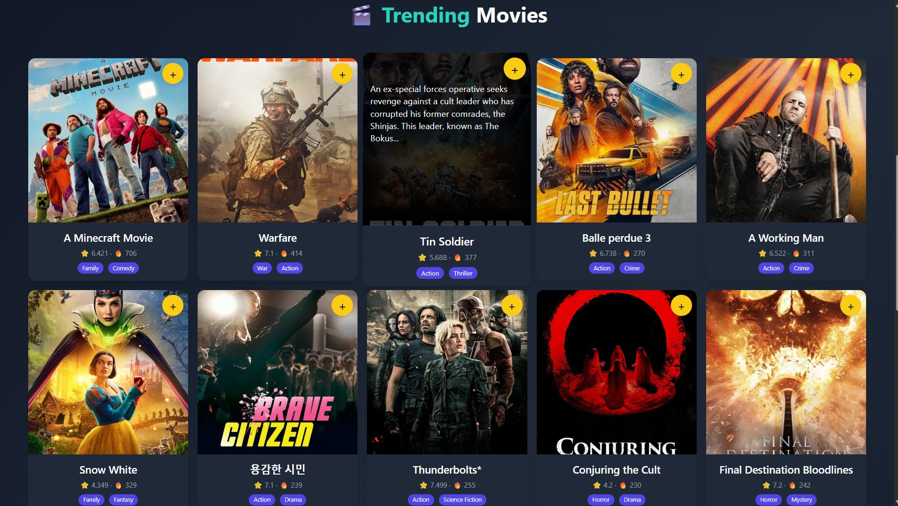
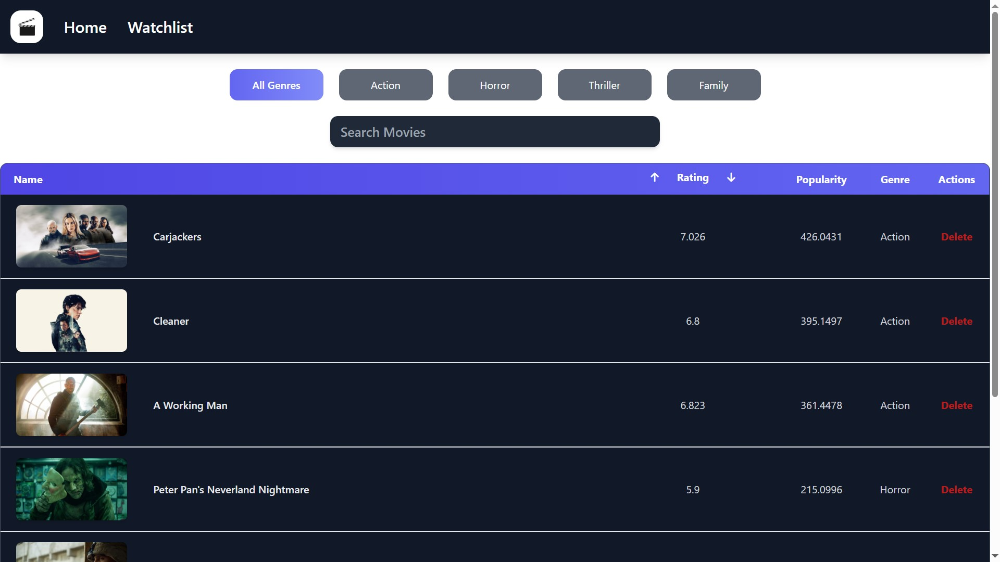
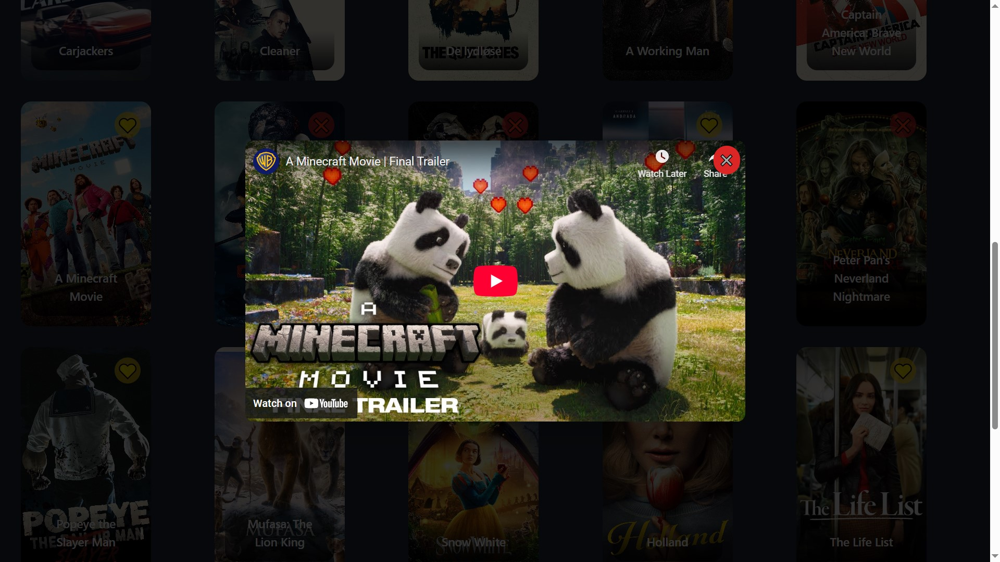

# 🎬 Movie-Show-Application

## 📌 Overview

**Movie-Show-Application** is a fully responsive and interactive frontend web app built using **React.js**, **Tailwind CSS**, and the **TMDB API**. It allows users to browse trending movies and TV shows, view details, manage a watchlist, and watch trailers — all through a clean, user-friendly interface.

The project is deployed on **Vercel** and includes CI/CD via GitHub Actions.

🔗 **Live Demo**: [Now Showing - Movie & TV Explorer](https://now-showing.vercel.app/)

---

## ✨ Features

### 🏠 Home Page
- Navigation bar with logo, **Home**, and **Watchlist** buttons.
- Hero **Poster** section showcasing highlighted content.
- Grid layout displaying **Movie/TV Show cards** with:
  - Title, rating, and popularity.
  - Hover effect on desktop and tap effect on mobile for brief descriptions.
- **Trailer Modal** popup for watching trailers (if available via TMDB).
- **Pagination** support:
  - Page navigation buttons.
  - "Go to Page" input box to jump to a specific page.

### ⭐ Watchlist
- Add movies/TV shows from the home page using an **Add** button.
- Once added, button changes to **Remove** (in both Home and Watchlist).
- Watchlist displayed as a responsive **table** with:
  - Title, rating, popularity, genre.
  - Remove button for each item.

### 🔍 Search, Sort & Filter
- **Search** functionality to find specific titles.
- **Filter** by genre.
- **Sort** by:
  - Rating (ascending/descending)
  - Popularity (ascending/descending)

### 📽️ Trailer Modal
- Click or tap a card to view trailers via YouTube embedded player.
- Trailer opens in a modal overlay (desktop & mobile-friendly).

---

## 🧩 Components

1. `Navbar` – Site-wide navigation.
2. `Poster` – Hero/banner section.
3. `Movies` – Fetches and displays movie/show data.
4. `MovieCard` – Renders individual movie/show info.
5. `Watchlist` – Displays saved movies/shows in a table layout.
6. `Pagination` – Controls for navigating through pages.
7. `TrailerModal` – Handles trailer video display via modal.

---

## 🛠 Tech Stack

- **React.js** – Component-based UI development
- **Tailwind CSS** – Utility-first styling
- **JavaScript** – App logic
- **TMDB API** – Movie and TV show data source
- **Axios** – HTTP requests
- **Local Storage** – Watchlist persistence
- **Vercel** – Deployment
- **GitHub Actions** – Continuous Integration (CI/CD)

---

## 🚀 Installation & Setup

```bash
# Clone the repository
git clone https://github.com/your-username/Movie-Show-Application.git
cd Movie-Show-Application

# Install dependencies
npm install

# Setup environment variables
# Create a `.env` file in the root with the following:
VITE_APP_TMDB_API_KEY=your_tmdb_api_key

# Start the development server
npm run dev

Open in browser:
```
http://localhost:5173
```

---

## 📸 Screenshots
- **Poster**


- **Home Page**


- **Watchlist**


- **Trailer Modal**


---

🔗 Visit Live
Explore the live application here:
👉 Now Showing - Movie & TV Explorer - https://now-showing.vercel.app/

---

## 🏆 Future Enhancements
- 🔐 User authentication for personalized watchlists
- 📆 Filter by year, language, runtime
- 🌙 Dark mode toggle
- 🌐 Internationalization (i18n)
- 🧪 Unit & integration tests

---

## 🤝 Contributing
-- Have suggestions or want to contribute?

- Fork the repository

- Create your feature branch (git checkout -b feature/YourFeature)

- Commit your changes (git commit -m 'Add YourFeature')

- Push to the branch (git push origin feature/YourFeature)

- Open a pull request

- All contributions are welcome!

---

## 🚀 Enjoy Exploring Movies & TV Shows! 🍿