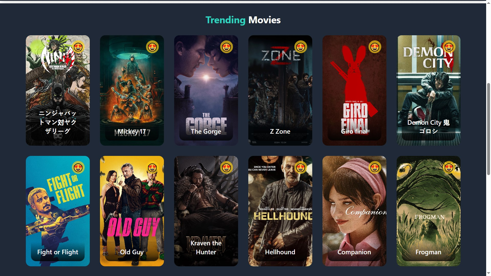

# 🎬 Movie-Show-Application

## 📌 Overview

Movie-Show-Application is a React.js-based web app that lets users explore trending movies and TV shows fetched from **TMDB API**. It provides an intuitive UI with **pagination**, a **watchlist feature**, and **sorting & filtering options**.

## ✨ Features

- 📌 **Home Page**
  - Displays **trending movies & TV shows**.
  - Uses **pagination** for easy navigation.
- ⭐ **Watchlist**
  - Users can **add favorite movies/TV shows** from the home screen.
  - Watchlist is stored using **local storage** for persistence.
- 🔍 **Sorting & Filtering**
  - Movies in the watchlist can be sorted **by rating & popularity** (ascending/descending).
  - Users can **filter movies by genre**.
- ❌ **Remove from Watchlist**
  - Users can delete movies from their watchlist anytime.

## 🛠 Tech Stack

- **React.js** - Frontend framework
- **Tailwind CSS** - Styling
- **Axios** - API requests
- **TMDB API** - Fetching movie & TV show data
- **Local Storage** - Data persistence for watchlist

## 🚀 Installation & Setup

1. Clone the repository:
   ```sh
   git clone https://github.com/your-username/Movie-Show-Application.git
   cd Movie-Show-Application
   ```
2. Install dependencies:
   ```sh
   npm install
   ```
3. Get an **API key** from [TMDB](https://www.themoviedb.org/).
4. Create a `.env` file and add:
   ```sh
   VITE_APP_TMDB_API_KEY=your_api_key_here
   and import it as const apiKey = import.meta.env.VITE_API_KEY;
   ```
5. Start the application:
   ```sh
   npm run dev
   ```
6. Open [http://localhost:5173](http://localhost:5173) in your browser.

## 📸 Screenshots

### 🎬 Home Screen


### ⭐ Watchlist


## 🏆 Future Enhancements

- ✅ User authentication for personalized watchlists.
- 📊 More sorting & filtering options.
- 🎭 Dark mode for better UI experience.

## 🤝 Contributing

Feel free to open an **issue** or submit a **pull request** if you'd like to contribute!

---

🚀 **Enjoy Exploring Movies & TV Shows!** 🍿
