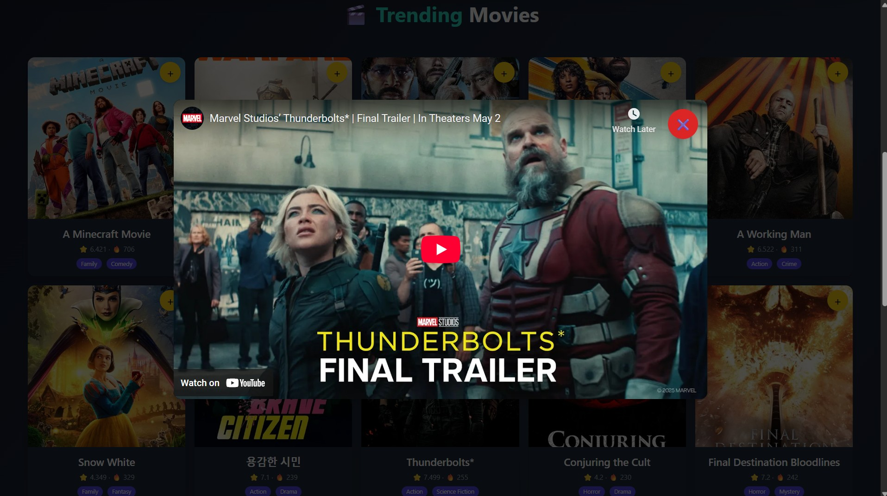

# 🎬 Movie-Show-Application

## 📌 Overview
Movie-Show-Application is a **React.js-based** web app that allows users to explore trending **movies and TV shows** using **TMDB API**. It offers an interactive and responsive UI with **pagination**, **watchlist**, **sorting**, **filtering**, and now, a **trailer viewing feature**.

---

## ✨ Features

### 📌 Home Page
- Displays **trending movies and TV shows**.
- Responsive **grid layout** with **pagination** for smooth navigation.

### ⭐ Watchlist
- Add movies/TV shows from the home screen to a personalized **watchlist**.
- **Persisted using local storage** for a seamless experience across sessions.

### 🔍 Sorting & Filtering
- **Sort** by rating and popularity (ascending/descending).
- **Filter** by genre with intuitive tag-like UI.

### ❌ Remove from Watchlist
- Remove items from the watchlist with a single click.

### 🎥 Trailer Modal Popup
- Click on any movie card to check for an available **trailer** using the **TMDB API**.
- If available, the trailer opens in a **modal popup** via YouTube embed.
- Fully **responsive** across all screen sizes.

---

## 🛠 Tech Stack
- **React.js** - Frontend framework
- **Tailwind CSS** - Styling
- **Axios** - API requests
- **TMDB API** - Movie & TV show data source
- **Local Storage** - Persistent watchlist

---

## 🚀 Installation & Setup

1. **Clone the repository:**
```bash
git clone https://github.com/your-username/Movie-Show-Application.git
cd Movie-Show-Application
```

2. **Install dependencies:**
```bash
npm install
```

3. **Get your TMDB API key**:
- Visit https://www.themoviedb.org/settings/api and generate a key.

4. **Create a `.env` file**:
```env
VITE_APP_TMDB_API_KEY=your_api_key_here
```

5. **Start the application:**
```bash
npm run dev
```

6. Open in browser:
```
http://localhost:5173
```

---

## 📸 Screenshots
- **Home Page**


- **Watchlist**


- **Trailer Modal**


---

🔗 Visit Live
Explore the live application here:
👉 Now Showing - Movie & TV Explorer

---

## 🏆 Future Enhancements
- ✅ User authentication for personalized watchlists
- 📊 Additional filters (year, language, runtime)
- 🎭 Dark mode toggle
- 🌐 Internationalization (i18n)

---

## 🤝 Contributing
Feel free to **open an issue** or **submit a pull request**. Contributions are always welcome!

---

## 🚀 Enjoy Exploring Movies & TV Shows! 🍿